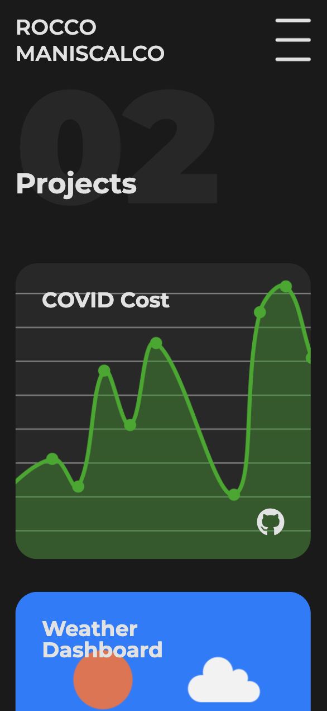
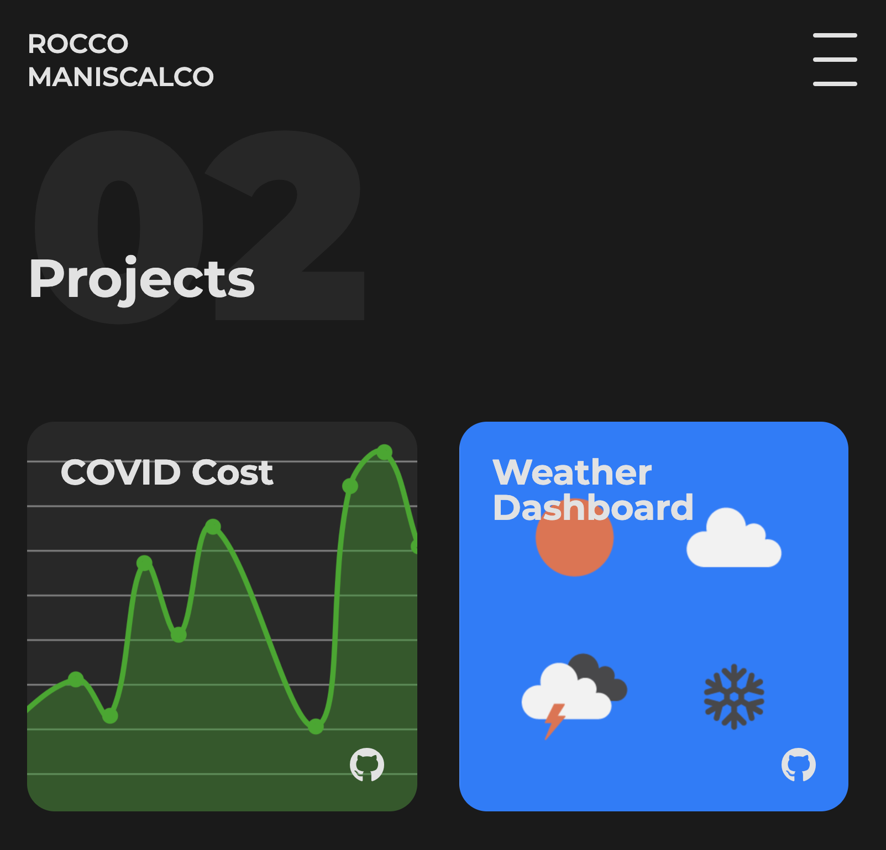

# Portfolio

This online portfolio was designed as an archive for projects and a means to express myself as a developer. The site contains a landing page, an about, projects, and a contact section.

The main focus of this project was design. In order to be compliant with modern web best practices, the site is responsive and optimized for mobile viewports. In line with the focus of the project, I challenged myself to build this site without the use of a CSS framework.

## Usage

Visit the online portfolio [here](https://roccomaniscalco.github.io/portfolio/).

## Installation

- Head over to the [portfolio repository](https://github.com/roccomaniscalco/portfolio)
- Press the green _code_ button and select method of download
- Open the repo in your text editor of choice.

## TODO

- Host the site on heroku with express routes
- Support an integrated messaging system

## License

Licensed under the [MIT](https://opensource.org/licenses/MIT) license.
